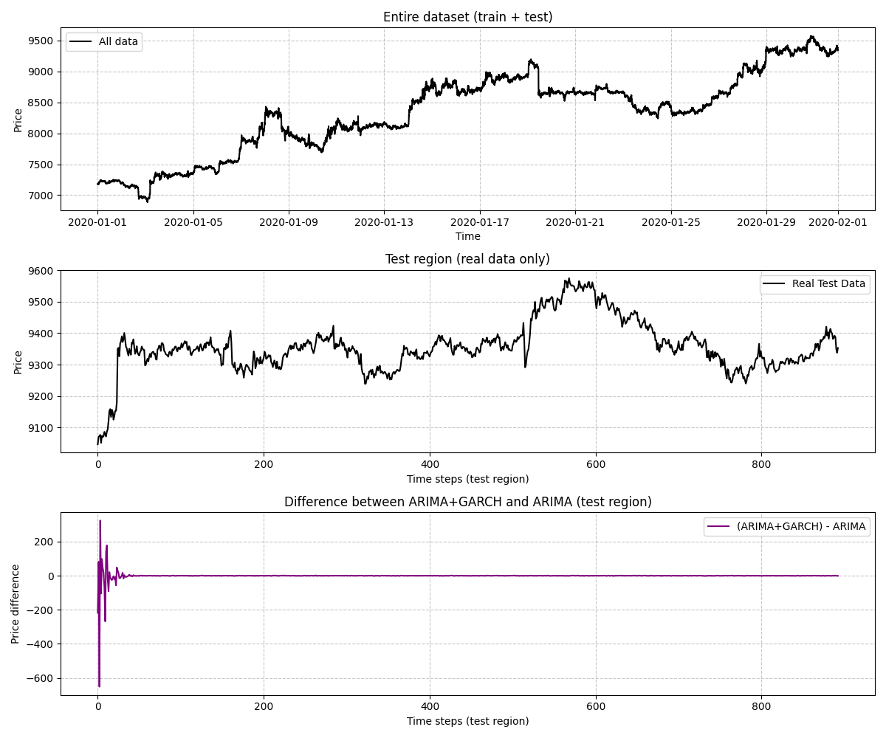

# TradingBot: Automated Trading Platform


TradingBot is a system designed to automate multiple trading strategies by integrating real-time data collection, fast
strategy execution, and comprehensive analytics. The platform is built with a modular architecture to ensure
scalability, security, and high performance.

## Table of Contents

1. [Overview](#overview)
2. [Key Features](#key-features)
3. [Architecture & Components](#architecture--components)
4. [Installation & Setup](#installation--setup)
1. [Required Dependencies](#required-dependencies)
2. [Building the Strategies API](#building-the-strategies-api)
5. [Backtesting & Metrics Visualization](#backtesting--metrics-visualization)
6. [Documentation & UML](#documentation--uml)
7. [Future Plans](#future-plans)

---

## Overview

TradingBot combines the power of C++ for high-frequency trading tasks with the flexibility of Node.js and Python for
user interaction and data visualization. The platform ensures:

1. **Real-Time Data Collection**  
   The `DataCollector` class constantly gathers market data from various sources, ensuring that all trading strategies
   operate with the latest information.

2. **Trading Strategies Execution**  
   Multiple strategies (scalping, mean reversion, arbitrage, ARIMA-GARCH, Bayesian signal filtering) are implemented in
   C++ for optimal speed and efficiency. Once data is collected, it is immediately routed to the corresponding strategy
   modules for processing and signal generation.

3. **Backtesting**  
   A comprehensive backtesting framework allows users to simulate strategies on historical data, evaluate performance,
   and fine-tune parameters before live deployment.

4. **API & Web Dashboard**  
   A RESTful API on Node.js provides endpoints for user authentication, strategy configuration, and retrieval of trading
   statistics.  
   Nginx is used as a reverse proxy for secure HTTPS connections. The entire backend is hosted on Yandex Cloud for
   reliability and scalability.  
   The web dashboard, built with modern JavaScript frameworks and deployed on Netlify, offers an intuitive interface to
   manage trading operations and view analytics.

5. **Metrics Visualization**  
   Python is utilized to generate performance metrics and charts, giving users a clear, real-time overview of trading
   performance.

---

## Key Features

1. **Real-Time Data Collection**

- The `DataCollector` class continuously aggregates live market data from various sources, ensuring that all strategies
  run on up-to-date information.

2. **Multiple Trading Strategies**

- **Scalping**: Executes high-frequency trades based on short-term price fluctuations using configurable indicators (
  e.g., moving averages, RSI).
- **Mean Reversion**: Identifies price deviations from a statistical norm and places trades expecting a return to the
  mean.
- **ARIMA-GARCH**: Combines time-series forecasting (ARIMA) with volatility modeling (GARCH) to trade on market
  volatility.
- **Bayesian Signal Filtering**: Uses Bayesian methods to filter market noise and produce robust trading signals.
- **Inter-Exchange & Intra-Exchange Arbitrage**: Capitalizes on price discrepancies across or within exchanges (e.g.,
  Binance, OKX, Kraken) for risk-managed profits.

3. **Backtesting Engine**

- Allows simulation of strategies on historical data, enabling users to evaluate performance, optimize parameters, and
  mitigate risks before going live.

4. **Robust API**

- A RESTful API powered by Node.js provides endpoints for authentication, strategy configuration, and trading
  statistics.
- Endpoints are secured and integrated with CORS support for seamless communication with the frontend dashboard.

5. **Secure Deployment**

- The application is deployed on Yandex Cloud with Nginx acting as a reverse proxy to handle HTTPS connections (using
  Let’s Encrypt).
- Node.js and C++ components ensure both flexibility and high performance for trading operations.

6. **Interactive Metrics Visualization**

- A Python-based module renders performance graphs and charts, allowing real-time tracking of trading outcomes and
  historical results.

---

## Architecture & Components

**High-Level Flow**:

1. **Data Collection Layer**

- Gathers real-time market data from multiple sources via APIs or streaming services.
- Feeds data directly into the strategy execution layer.

2. **Strategy Execution Layer (C++ Libraries)**

- Implements various trading strategies and communicates with exchanges/brokers for order placement.
- Optimized for high performance and speed-critical operations.

3. **API Layer (Node.js)**

- Provides REST endpoints for user management, strategy configuration, and performance tracking.
- Integrates with Nginx for secure HTTPS connections.

4. **Web Dashboard (Netlify)**

- Offers a frontend interface for monitoring trades, configuring strategies, and visualizing metrics.
- Deployed globally for low-latency user access.

5. **Analytics & Visualization (Python)**

- Generates performance reports, charts, and forecasts.
- Can be scaled separately for reliability and efficiency.

---

## Installation & Setup

### Required Dependencies

1. **Boost 1.86.0** (primarily for JSON library):
   ```bash
   wget https://archives.boost.io/release/1.86.0/source/boost_1_86_0.tar.bz2
   tar -xvjf boost_1_86_0.tar.bz2
   cd boost_1_86_0/
   chmod +x ./bootstrap.sh
   ./bootstrap.sh
   sudo ./b2 install
   sudo make install
2. Additional Dependencies

    ```bash
    sudo apt update
    sudo apt install libssl-dev libcurl4-openssl-dev libeigen3-dev libjsoncpp-dev
    ```

3. Building the Strategies API

    ```bash
    git clone git@github.com:Bonartze/TradingBot.git
    cd TradingBot/TradingStrategies && mkdir build && cd build
    cmake ../ && make -j$(nproc)
    sudo make install
    ```

## Backtesting & Metrics Visualization

The project includes a backtesting framework for simulating strategies on historical data:

- Historical Data Loading: Load market data from CSV files or a database.
- Strategy Simulation: Test each strategy’s performance under various conditions.
- Performance Metrics: Evaluate key metrics such as Profit & Loss (PnL), Sharpe ratio, and drawdown.
- Graphs & Reports: Python scripts generate visual insights into trading results, such as:

<div style="display:flex;">
  
  
  
</div>


You can find more details and artifacts in
the [all-backtesting-results](https://github.com/Bonartze/TradingBot/actions/runs/14131001389/artifacts/2839516841)
and [models-metrics-results](https://github.com/Bonartze/TradingBot/actions/runs/14131001389/artifacts/2839516922)

## Documentation & UML

A comprehensive set of documentation, including UML diagrams and Doxygen-generated class references, is available at:
https://bonartze.github.io/TradingBot/

## Some instruction of website usage


Pattern to find statistics for your strategy: [strategy_name]_[full_mail].csv

(Eg. scalping_bonartze@gmail.com.csv

So, here it can be easily seen logs (with all your trades) and created graph, depicting all above

## Future Plans

- Additional Strategies
- Possible integration of machine learning and advanced time-series approaches.
- Extended Exchange Integrations
- Ongoing support for an even wider range of cryptocurrency and traditional exchanges, including Binance, OKX, Kraken,
  and more.
- More interactive charts, real-time data streams, and improved dashboards.
  Community Contributions

We welcome pull requests for new features, bug fixes, and general improvements.

